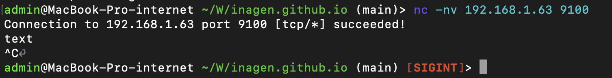
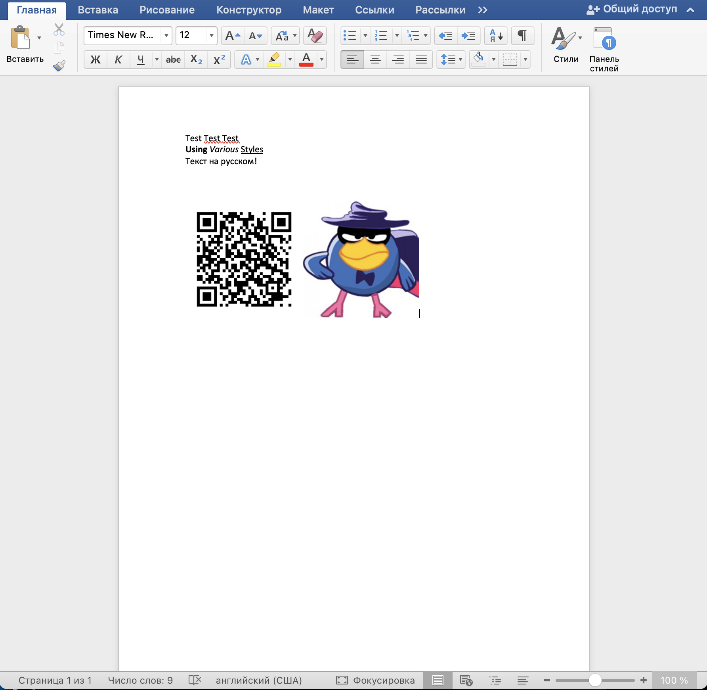
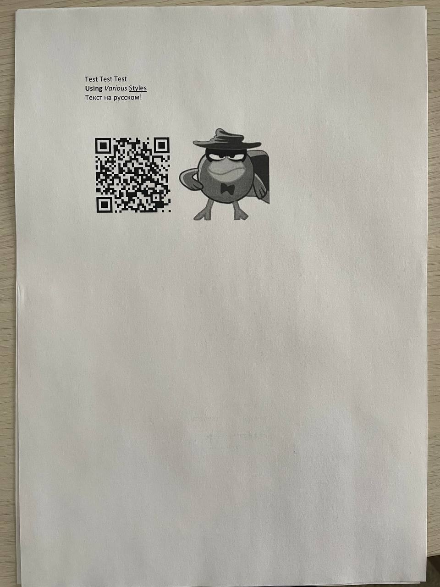

Hi all! This is my first post in this blog, so do not judge strictly :)

Today I want to tell you about my phishing attack experience through the printers as part of RedTeaming. 

At the very beginning of the RedTeaming, I started massive scan of the local network on popular ports (22, 23, etc.). When I realized that I would not find anything interesting here, I decided to look at the printers. After running scan on port 9100, I found a huge variety of devices. And then an interesting thought came to me. What if I send a phishing document to a large number of devices? This should work, my end goal was to get the workers credentials.

Firstly, I tried sending plain text over TCP via netcat. 



And... It works!


After a little research on the Internet, I found out how printers work. Here is three main languages to operate printers: 

* Printer Job Language (PJL)
* Printer Command Language (PCL)
* Post Script (PS)

PJL used to tell the device which language to use PCL or PS. I tried to use PCL, but something went wrong and I switched to PS. To my happinnes Microsoft Word can save documents as PostScript files (in print menu).

So I created test word document with text and images


Saved this document as PostScript file and send it to printer via netcat


AND IT ALSO WORKS!


Since there were no PJL tags in the document, I suspect that the printer automatically determined the file format and printed it. However, it's not certain that other printers in the office can handle it, so I had to add the tags myself. But since the work was on a tight schedule, I did not have much time to figure it out and I found a ready-made script on the Internet. This script is called [Printer Exploitation Toolkit](https://github.com/RUB-NDS/PRET). It allows you to do many things besides printing, but at the time of the RedTeaming, I only needed one - this script automatically adds required PJL tags to the document before sending it.

I created a list of IP addresses of devices with open port 9100 and wrote a small bash script to automatically send a file to each device from the list. 
Here is the script:
```bash
#!/bin/bash

echo "Super massprinting script by inagen"

ip_addresses=$1
file_to_send=$2

touch command_file
echo "print $file_to_send" > command_file
echo "exit" >> command_file

while read ip_addr; do
echo "Sending to $ip_addr"
./pret.py -q -i command_file $ip_addr ps
done < $ip_addresses

```
And it worked! I checked on several printers nearby.

So, I figured out the technical part, all that remained was to come up with a good text and set up a phishing site. The text was:
```
Dear colleagues!
We notify you of the scheduled inspection of the equipment. If you are reading this text, please scan the QR-code below, follow the link and confirm your device details.
```
The QR-code contained a link to a one-page site with BasicAuth. Not too pretty, but I didn't have much time :)

Everything is ready, start the attack! There were about 1700 printers  in the local network, but I chose a random 300 to avoid making too much noise. 

After half an hour of waiting, I got the following results

- More than ten people followed the link
- Two people entered their credentials

These credentials were enough to carry out the attack further and get users' personal data :)

Let's draw conclusions. Printers and other devices to this day remain a weak point in information security. This is a good attack vector, especially when combined with good social engineering. How could this attack be prevented? I think that the printer needs to be isolated on a separate local network that is inaccessible to ordinary computers. You should also conduct preventive conversations with employees to develop immunity to this kind of phishing.